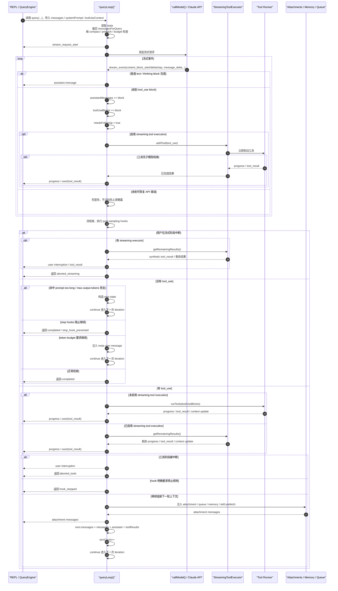

# 单次 Agent Loop 时序图

下面这张图对应的是 `src/query.ts` 里 `queryLoop()` 的“一次 iteration”主流程，也就是一次 `模型采样 -> 可能执行工具 -> 决定是否进入下一轮`。

可以把它压缩成一句话理解：

`queryLoop` 不是“一问一答”，而是一个内部小状态机：

`准备上下文 -> 流式采样 -> 收集 tool_use -> 执行工具 -> 把 tool_result 回灌消息历史 -> 再次采样，直到没有 follow-up 为止`

几个关键代码位置：

- 主循环和 `state` 在 `src/query.ts`
- 流式采样与 `needsFollowUp` 在 `src/query.ts`
- 无工具时的恢复/终止分支在 `src/query.ts`
- 工具执行与下一轮 state 构造在 `src/query.ts`
- streaming 工具执行器在 `src/services/tools/StreamingToolExecutor.ts`
- 普通工具编排在 `src/services/tools/toolOrchestration.ts`
